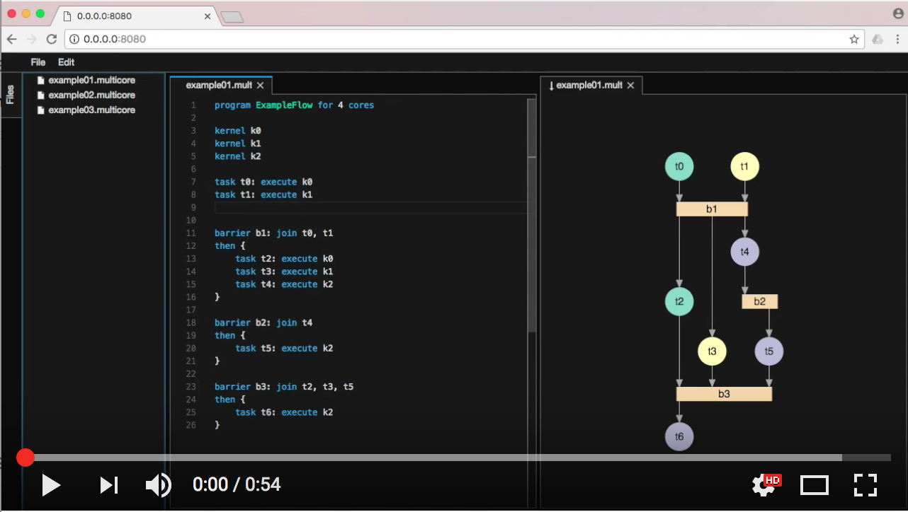

# theia-sprotty-example
An example application integrating graphical [sprotty](https://github.com/TypeFox/sprotty) views for an [Xtext](http://www.xtext.org)-based DSL with [Theia](https://github.com/theia-ide/theia)

[](http://www.youtube.com/watch?v=S8WCwwfHDfU "sprotty Theia Demo")

## Build and Run
After checking out sprotty, Theia and this repository into the same root directory, do
```bash
git clone git@github.com:theia-ide/theia.git
git clone git@github.com:TypeFox/sprotty.git
git clone git@github.com:TypeFox/theia-sprotty-example.git

# Prepare sprotty
cd sprotty/client
npm install
cd ../..

# Prepare Theia 
cd theia
npm install
cd ..

# Build the diagram aware language server for the example DSL
cd theia-sprotty-example/server
./gradlew installDist
cd ..

# Prepare the Theia extension for the example DSL
cd theia-dsl-extension
npm install
cd ..

# Build and run the Theia webapp
cd theia-app
npm install
npm run build
npm run start

# Build the Theia electron app
cd theia-electron
npm install
npm run build
npm run start
```
